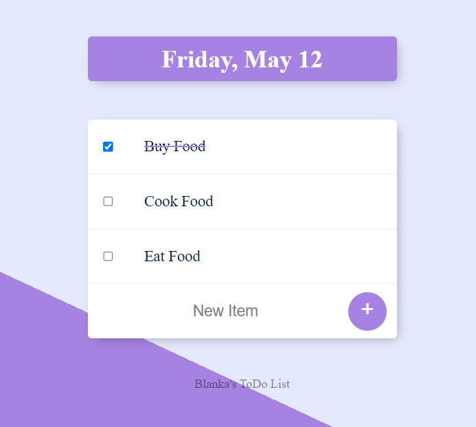

## About
Welcome to the ToDo List Web Application! This application is designed to help you stay organized and manage your tasks effectively.
## Demo




## Features

- Create and Manage Tasks: Easily add new tasks to your ToDo list, categorize them, and mark them as completed.
- Intuitive User Interface: The user-friendly interface allows for effortless task management and navigation.
- Responsive Design: Access your ToDo list from any device, whether it's a desktop, tablet, or mobile phone.
- Simple and Lightweight: Built with Node.js, Express, and EJS, the app is lightweight and efficient.

## Installation

To install and run the application locally, follow these steps:

1.Clone the repository:
```bash
  git clone https://github.com/MarkusBlanka/ToDo-List.git
```
2.Navigate to the project directory:
```bash
  cd <project directory>
```
3.Install dependencies: 
```bash
  npm install
```
## Run Locally

To run the application locally, use the following command:

```bash
  npm start
```
Once the server is running, you can access the application by visiting http://localhost:3000 in your web browser.


## Usage

- Adding Tasks: Type your task in the input field and click the "Add" button. 
- Managing Tasks: Once added, tasks will appear in the list. You can mark tasks as completed by clicking the checkbox next to them. Completed tasks will be visually distinguished.
- Work List: Access localhost:3000/work and manage your work-related tasks separately.


## Dependecies

- Express.js: Fast, unopinionated web framework for Node.js.
- EJS: Embedded JavaScript templates for rendering dynamic web pages.
- Body Parser: Middleware to handle HTTP request body parsing.

## Acknowledgements

- This project was created as part of the Web Development Course on Udemy.
- Thanks to the course instructor and team for providing valuable guidance and resources throughout the development process.
